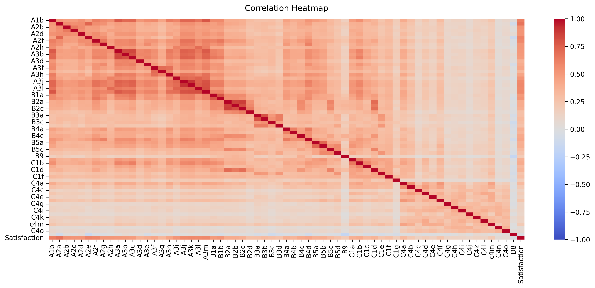
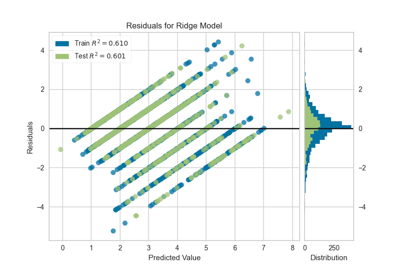

# Job-satisfaction

## Predicting Job Satisfaction with Ridge Regression

### Set working directory and load data

import os
import pandas as pd

os.chdir('C:/Users/Alejandro/Documents/')
df = pd.read_csv('jobsat3881.csv')
df.info()

import numpy as np
import seaborn as sns
import matplotlib.pyplot as plt

### from sklearn import datasets

from sklearn.model_selection import train_test_split
from sklearn.linear_model import Ridge
from sklearn.metrics import mean_squared_error
from sklearn.preprocessing import StandardScaler

### Correlation matrix

Increase the size of the heatmap

plt.figure(figsize=(16, 6))

Store heatmap object in a variable to easily access it when you want to
include more features (such as title).
Set the range of values to be displayed on the colormap from -1 to 1, and
set the annotation to True to display the correlation values on the heatmap.

heatmap = sns.heatmap(df.corr(), vmin=-1, vmax=1, annot=False, cmap='coolwarm')

Give a title to the heatmap. Pad defines the distance of the title from
the top of the heatmap.

heatmap.set_title('Correlation Heatmap', fontdict={'fontsize':12}, pad=12)

plt.savefig('Correlation_matrix.png', dpi=300, bbox_inches='tight')

### Extract the features and the target

X = df.drop('Satisfaction',axis=1)
y = df['Satisfaction']

### Train-test split

from sklearn.model_selection import train_test_split

X_train, X_test, y_train, y_test = train_test_split(X, y, test_size=0.30,
                                                          shuffle=False,
                                                          random_state = 1234)
### Scale the data using StandardScaler

scaler = StandardScaler()
X_train_scaled = scaler.fit_transform(X_train)
X_test_scaled = scaler.transform(X_test)

### Fit Ridge regression model

from sklearn.linear_model import Ridge

### Initialize the Ridge regression model with default settings

model = Ridge()

### Fit the model on the training data

model.fit(X_train, y_train)

### Choosing the Regularization Parameter λ

from sklearn.linear_model import RidgeCV

Set up a range of possible lambda values

alphas = [0.1, 1.0, 10.0, 100.0]

Initialize the RidgeCV model to find the best lambda

ridge_cv_model = RidgeCV(alphas=alphas, store_cv_results=True)

### Fit the model on the training data

ridge_cv_model.fit(X_train, y_train)

### Print the best alpha (lambda) value

print(f"Optimal lambda: {ridge_cv_model.alpha_}")

### Make predictions on the test set

y_pred = model.predict(X_test)

### Calculate evaluation metrics

from sklearn.metrics import root_mean_squared_error

from sklearn.metrics import mean_absolute_percentage_error, mean_squared_error, r2_score, explained_variance_score, mean_absolute_error

mape = mean_absolute_percentage_error(y_test, y_pred)

mse = mean_squared_error(y_test, y_pred)

rmse = root_mean_squared_error(y_test, y_pred)

mae = mean_absolute_error(y_test, y_pred)

r2 = r2_score(y_test, y_pred)

explained_var = explained_variance_score(y_test, y_pred)

### Print the evaluation metrics

print("MAPE, mean absolute percentage error:", mape)

print("MSE, Mean squared error:", mse)

print("RMSE, Root mean squared error:", rmse)

print("MAE, Mean absolute error:", mae)

print("R2, R-squared:", r2)

print("Explained variance:", explained_var)

### Prediction error plot

import matplotlib as plt

import yellowbrick

from yellowbrick.regressor import PredictionError

visualizer = PredictionError(model)

visualizer.fit(X_train, y_train)      # Fit the training data to the visualizer

visualizer.score(X_test, y_test)      # Evaluate the model on the test data

visualizer.show()     # Finalize and render the figure

### Residuals plots on training and testing data

from yellowbrick.regressor import ResidualsPlot

visualizer = ResidualsPlot(model)

visualizer.fit(X_train, y_train)      # Fit the training data to the visualizer

visualizer.score(X_test, y_test)      # Evaluate the model on the test data

visualizer.show()                     # Finalize and render the figure

